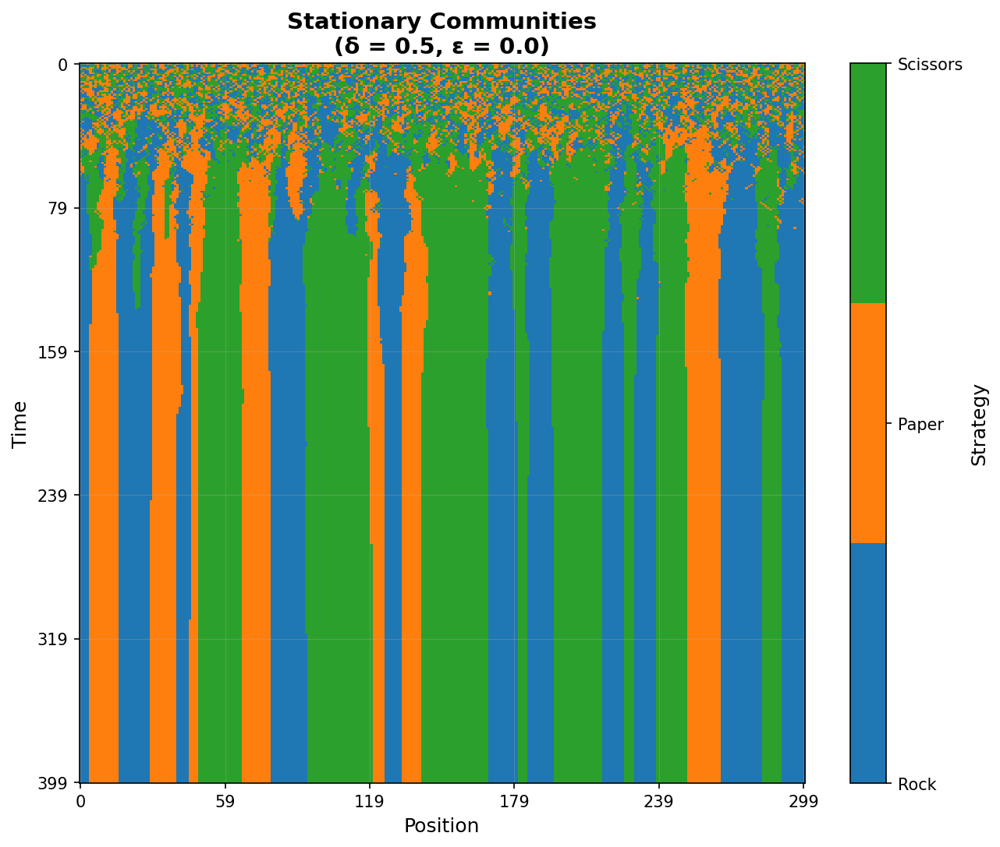
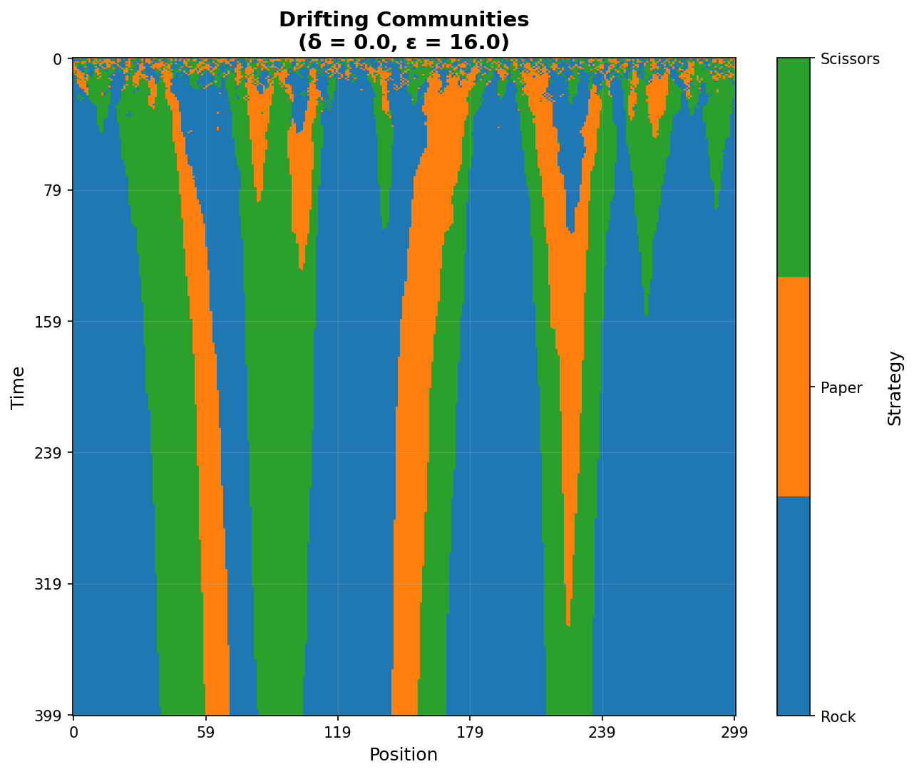
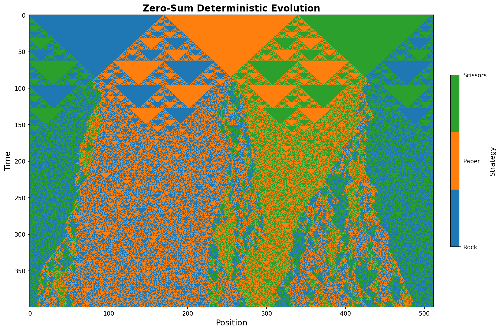
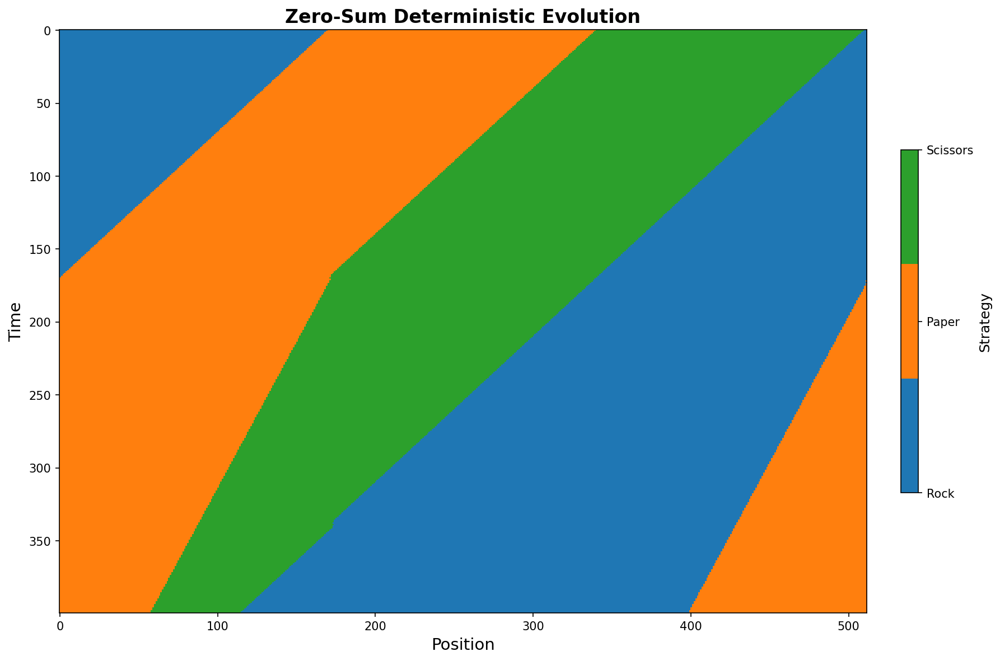

# RPS Simulation  
With Dr. Jackson Henry of WPI's HPC, I work to extend the work of [Community Formation in Wealth-Mediated Thermodynamic Strategy Evolution (Olsen et. al.)](https://arxiv.org/pdf/2206.13160). I created this [GitHub repository](https://github.com/AdamField118/game_theory) to learn the basics of this work.

## What Is The Paper Talking About?  
So at the most basic level there are what we call **"agents" or players** in the simulation, they have a **bank value** which keeps track of their performance. These agents play **rock paper scissors** with their neighboring agents. One of the main forms of modularity between simulations is a **payoff matrix**, which basically describes what the reward (or punishment) is for winning, losing, or tying.  
There are a different types of payoff matrices, such as the positive, symmetric payoff matrix defined in the *Olsen et. al.* equation 3:

$$A(\epsilon,\delta)=\begin{bmatrix}1+\delta & 0 & 2+\epsilon\\
                                    2+\epsilon & 1+\delta & 0\\
                                    0 & 2+\epsilon & 1+\delta  \end{bmatrix}$$

Another key form of modularity is, and the coolest part of this simulation, is how agents decide what to play next, called the **selection strategy**. Instead of just copying the most successful neighbor, they a **Boltzmann distribution**. This is right out of physics - it's the same math that describes how atoms behave at different temperatures in thermodynamics.

Here's the basic idea: each agent looks at their neighborhood and calculates something called **neighborhood bank values** for each strategy. Think of it like this - if you're trying to decide whether to play rock, you look around and add up all the bank values of your neighbors who are currently playing rock. Same for paper and scissors.

The probability of choosing a strategy is then:
$$P(\text{choose strategy } s) = \frac{e^{\beta N_s}}{\text{sum of } e^{\beta N_k} \text{ for all strategies}}$$

Where:
- $N_s$ is that neighborhood bank value for strategy $s$
- $\beta = \frac{1}{kT}$ is like an "inverse temperature" parameter, sometimes called coldness
The temperature $T$ is basically a "randomness knob" for the simulation:
- **Low temperature** (high $\beta$): Agents are very rational - they almost always copy successful neighbors
- **High temperature** (low $\beta$): Agents are more random - they might choose poorly performing strategies just because

As the simulation runs, agents accumulate wealth in their banks, which makes them effectively "colder" and less likely to change strategies. It's like they get more stubborn as they get richer!

Here's where it gets really interesting. Depending on the relationship between $\epsilon$ (winning bonus) and $\delta$ (tie bonus), you get completely different behaviors:

**Case 1: $2\delta > \epsilon$ (Stationary Communities)**
- Communities form and stay put
- Like stable neighborhoods that don't change
Here is a graph generated by my code where $\delta=0.5$ and $\epsilon=0.0$  

Do you see the randomness, followed by stable community formation?

**Case 2: $\epsilon > 2\delta$ (Drifting Communities)** 
- Communities form but slowly migrate across the lattice
- Like nomadic tribes that gradually move
Again, here is a graph generated by my code where $\delta=0.0$ and $\epsilon=16.0$  

See how the communities vary in size, sometimes even dissapearing?

The math behind this comes from analyzing what happens at community boundaries - basically asking "what's the probability a player at the edge of a rock community will switch to paper?" The answer depends on these parameter relationships in surprisingly precise ways.

## Where Do We Do For Our Work?

In our work we use a **zero-payoff matrix**, this just means when an agent wins they gain as much as they lose for losing, zero for a tie. Along with this, rather than using a Boltzmann distribution we use what we call a **deterministic selection strategy**, this is really simply compared to the Boltzmann distribution, we just have an agent choose their next strategy based off of the agents directly adjacent to them (the agents are standing in a ring). In order to select, they look at the agents next to them and choose the strategy that has the highest bank value out of those agents. 
This leads to interesting graphs right now, that quite frankly smell slightly of an error somewhere. Here is a graph generated with this configuration: 

Isn't this fascinating? Dr. Jackson says it reminds him of [rule 30](https://nam11.safelinks.protection.outlook.com/?url=https%3A%2F%2Fmathworld.wolfram.com%2FRule30.html&data=05%7C02%7Cadfield%40wpi.edu%7C9943b28b1b3f40876ee208ddd038c122%7C589c76f5ca1541f9884b55ec15a0672a%7C0%7C0%7C638895664361279650%7CUnknown%7CTWFpbGZsb3d8eyJFbXB0eU1hcGkiOnRydWUsIlYiOiIwLjAuMDAwMCIsIlAiOiJXaW4zMiIsIkFOIjoiTWFpbCIsIldUIjoyfQ%3D%3D%7C0%7C%7C%7C&sdata=DanvLevhk0TyqHjMKsqPHgIp5p4LMR5xUijP%2BaXettc%3D&reserved=0) which leads to him believing an error in the code, but him and I both independtly arrived at this result.  

After producing this graph, my advisor noticed a slight error in the selection strategy, what he said to me is this, If we consider three agent in a horizontal row like:

+---+  +---+  +---+
| R |  | P |  | R |
| 2 |  | 4 |  | 2 |
+---+  +---+  +---+

> "Then both R and P have the same apparant success from the middle agent perspective, but actually P has better fitness for every local individual playing that strategy."

This basically says that rock wins in the example and the paper agent strays from its strategy even through it would do better to stay paper, tying at worst next round. I accounted for this by counting the amount of agents using a strategy and dividing the sum of their banks by that amount so for example:

Rock: total=4, count=2 -> average = 4/2 = 2
Paper: total=4, count=1 -> average = 4/1 = 4
Scissors: total=0, count=0 -> average = 0
Result: [2, 4, 0] -> Paper is chosen

This small small changed resulted in a drastic difference in how the system evolved:

This result seems a bit fishy to me though, do you see around time step 160 how the boundary between paper and scissors suddenly changes? Along with the other side of that very same paper community changing the same way at the very moment it wraps to the other side of the graph.  

What I think is happening here is a fundamental error in how we select the next strategy in the event of a three way tie. Meaning we already (most likely) fixed a two way tie that does not include the agent in question, but how does an agent select their strategy if the situation is this:

+---+  +---+  +---+
| R |  | P |  | S |
| 1 |  | 1 |  | 1 |
+---+  +---+  +---+

In my code, the paper agent would simply default to rock. It has a priority list: if three way tie, then rock->paper->scissors. So if the situation was this:

+---+  +---+  +---+
| S |  | P |  | P |
| 1 |  | 1 |  | 1 |
+---+  +---+  +---+
It would choose paper.  

This to me is a glaring issue. It heavily favors low index strategies and to me reveals why it seems the rock community is steadily growing larger while the scissors communities seem to be dissapearing.

I have yet to tackle this issue in my own way, but I want to make a sort of "peaking" method, where the agent "looks" one more agent farther in each direction, taking their bank values, and encorporating it into their calculation for their next strategy, hence the "peaking". The agent would keep extending their sight until they reached a conclusion.  
My advisor has briefly discussed with me his thought of just having an agent choose to stay the same in the event of a three way tie. 

## Conclusion

Email me if you have ideas or questions, you probably know me if you're on this site, but my email is adfield@wpi.edu.