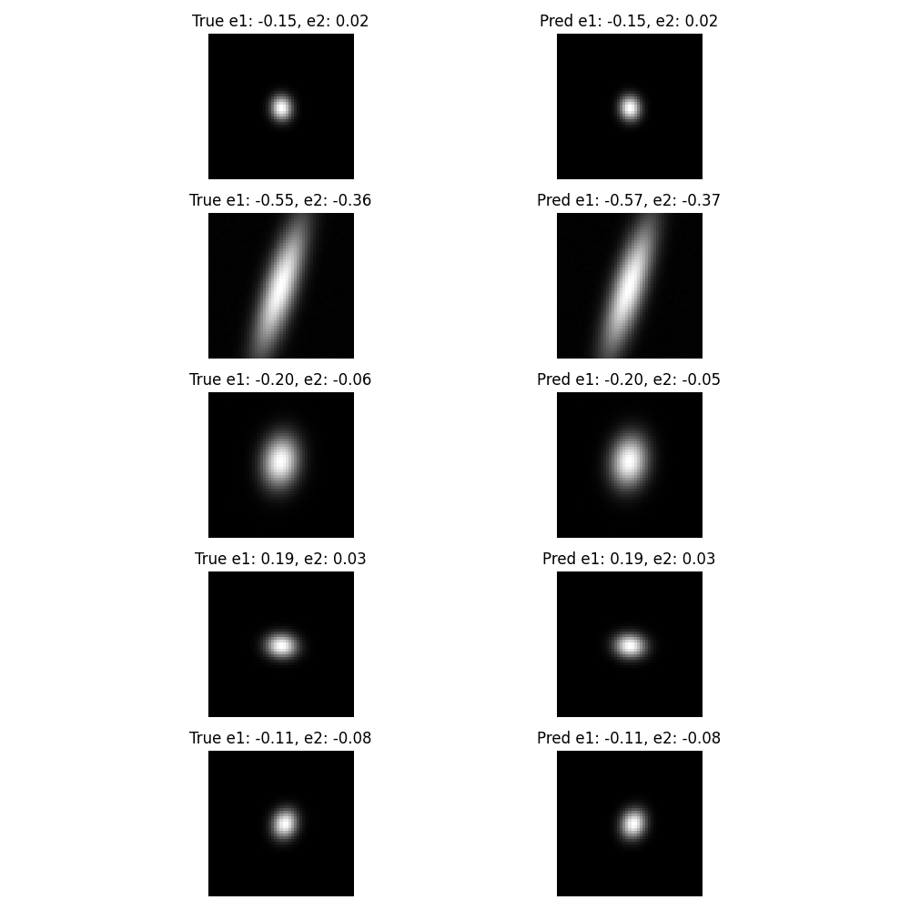

# ShearNet
Going into the summer between my 2nd and 3rd year of college, I needed an internship or research position. Unfortunately, likely due to budget cuts, I didn't get excepted to any of the nearly 20 REUs I applied to.  

I am very fortunate to have had a connection to Professor Jacqueline McCleary at Northeaster University. I reached out desperately and she gave me unpaid work to do! This turned out to be one of the best cold emails I have ever done in my life. Prior to meeting with Professor for summer research, I had never met her face-to-face, simply doing research in collaboration with her at WPI. I am so very grateful that she ended up putting me on a project underneath her post-doc Dr. Sayan Saha.  

Dr. Sayan had me immediately start work on ShearNet, a neural network based, gpu accelerated, shear estimator. This research is so cool to me, it's directly adjacent to the superbit-lensing project that I'm very interested in and it is solving a real problem for researchers in the field of weak lensing.  

## Okay... but what is it?  
So at first a nueral network based shear estimator sounds ambiguous, what is it doing? Is it just another AI?  
Here is the [github repo](https://github.com/s-Sayan/ShearNet/tree/main).  
First let me lay out the goal of ShearNet.  
### ShearNet's Goal
The ultimate goal is pretty straightforward: look at images of galaxies and figure out how much they've been "stretched" or "sheared" by gravitational lensing. But like most things in astrophysics, the devil is in the details.

When light from distant galaxies travels through space, it gets bent by the gravity of massive objects like galaxy clusters. This bending slightly distorts the shapes of galaxies - imagine looking at your reflection in a funhouse mirror, but *way* more subtle. We call this effect **weak gravitational lensing**, and measuring these tiny distortions tells us about the distribution of matter in the universe.

The problem? These distortions are *really* small - we're talking about shape changes of maybe 1-5%. And on top of that, galaxies already have their own intrinsic shapes, the telescope's optics blur everything (the PSF - Point Spread Function), and there's noise in every image. It's like trying to measure the height of a sandcastle while wearing foggy glasses during an earthquake.

### The Traditional Approach
Astronomers have a few main methods for measuring galaxy shear:

**NGmix (Maximum Likelihood Fitting):** This approach fits mathematical models (like Gaussian profiles) to galaxy images. It's robust and well-tested, but incredibly slow - we're talking minutes per galaxy. When you need to analyze millions of galaxies, that's a problem.

**Metacalibration:** This method artificially shears images in known ways to calibrate the measurements. It's more accurate than NGmix in many cases, but still computationally expensive and involves a lot of complex processing steps.

Both methods work, but they're bottlenecks. Future surveys like LSST will observe billions of galaxies, and we need something faster.

### Enter Neural Networks
This is where ShearNet comes in. Instead of fitting complex mathematical models or doing elaborate calibration procedures, we train a neural network to look at galaxy images and directly predict the shear parameters.

The network takes in an image of a galaxy and outputs four numbers:
- **g1, g2**: The two components of gravitational shear
- **sigma**: The size of the galaxy 
- **flux**: How bright the galaxy is

We train it on simulated galaxy images (see [GalSim](https://github.com/GalSim-developers/GalSim)) where we know the "true" answers, so the network learns to recognize the subtle patterns that correspond to different amounts of shear.

Here is a real example straight from the pipeline of galaxies we train the model on:

### Why This Matters
The beauty of this approach is speed. Once trained, our neural network can process a galaxy image in milliseconds instead of minutes. We're talking about speedups of 100x or more compared to traditional methods.

But here's the kicker - it's not just about being fast. In our tests, ShearNet achieves comparable or even better accuracy than the traditional methods. The mean squared error on our test sets is around 6.75e-6 for our best architecture, compared to ~1e-4 for moment-based methods.

### The Technical Foundation
ShearNet is built using JAX (Google's research framework) and Flax for the neural network components. We've experimented with several architectures:

- **Simple MLP**: A basic multi-layer perceptron that flattens the image
- **CNN**: Convolutional layers that preserve spatial structure
- **ResNet**: Residual networks for deeper architectures
- **Research-backed**: The most complex model with multi-scale processing and attention mechanisms

The "research-backed" architecture is particularly interesting - it processes galaxy images at multiple scales simultaneously (3x3, 9x9, and 21x21 kernels) because galaxies have features at different size scales. It also includes attention mechanisms to focus on the most important parts of each image.

## Conclusion

That covers the fundamentals of what ShearNet is and why it exists. The project represents a shift from traditional, computationally expensive methods to modern machine learning approaches that can handle the massive data volumes of next-generation astronomical surveys. In future posts, I'll dive deeper into the technical implementation, training strategies, and how we validate our results against established methods.

I will be doing much more blogs on this topic, since it will likely result in a publication with my name in the third author position (I know ambitious, but I believe). 

Also see "Part 2: ShearNet's Progress" for a what I am have implemted and what I am currently working on, as this was a fundamental-type blog.