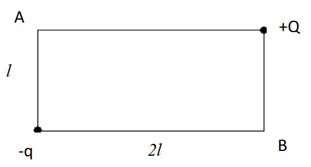

# Conservation of Energy: Why Δ(v²) ≠ (Δv)²

## The Problem

Consider an electron moving from point A with initial speed v₀ to point B in an electric field created by two point charges (+Q and -q) placed at opposite corners of a rectangle with dimensions l (height) × 2l (width):

**Setting up coordinates:** Origin at bottom-left corner
- -q is at (0, 0) - bottom-left
- +Q is at (2l, l) - top-right
- Point A is at (0, l) - top-left (electron starts here)
- Point B is at (2l, 0) - bottom-right (electron ends here)

**Question:** What is the electron's speed when it reaches point B?

## Solution Using Conservation of Energy

Energy conservation states that the total mechanical energy remains constant:

$$U_A + K_A = U_B + K_B$$

where U is potential energy and K is kinetic energy.

### Computing the Potential Energies

The electron has charge -e. At each point, the potential energy is the sum of contributions from both charges.

**At point A (0, l):**
- Distance to -q: l
- Distance to +Q: 2l

$$U_A = k\frac{(-e)(-q)}{l} + k\frac{(-e)(+Q)}{2l} = \frac{keq}{l} - \frac{keQ}{2l} = \frac{ke(2q - Q)}{2l}$$

**At point B (2l, 0):**
- Distance to -q: 2l  
- Distance to +Q: l

$$U_B = k\frac{(-e)(-q)}{2l} + k\frac{(-e)(+Q)}{l} = \frac{keq}{2l} - \frac{keQ}{l} = \frac{ke(q - 2Q)}{2l}$$

**Change in potential energy:**

$$\Delta U = U_B - U_A = \frac{ke(q - 2Q)}{2l} - \frac{ke(2q - Q)}{2l} = \frac{-ke(q + Q)}{2l}$$

### Solving for Final Velocity

The kinetic energy is $K = \frac{1}{2}m_e v^2$. From conservation of energy:

$$\frac{1}{2}m_e v_A^2 + U_A = \frac{1}{2}m_e v_B^2 + U_B$$

Rearranging:

$$\frac{1}{2}m_e v_B^2 = \frac{1}{2}m_e v_A^2 + U_A - U_B$$

$$\frac{1}{2}m_e v_B^2 = \frac{1}{2}m_e v_A^2 - \Delta U$$

$$v_B^2 = v_A^2 - \frac{2\Delta U}{m_e}$$

Therefore, the final speed is:

$$v_B = \sqrt{v_A^2 - \frac{2\Delta U}{m_e}}$$

Substituting our expression for ΔU:

$$v_B = \sqrt{v_A^2 + \frac{ke(q + Q)}{l \cdot m_e}}$$

This is the correct answer.

## The Disagreement

An alternative approach was proposed that leads to a different result. This approach claims that the change in kinetic energy can be written as:

$$\Delta K = \frac{1}{2}m_e(\Delta v)^2 = \frac{1}{2}m_e(v_B - v_A)^2$$

This would lead to:

$$\frac{1}{2}m_e(v_B - v_A)^2 = -\Delta U$$

$$(v_B - v_A)^2 = -\frac{2\Delta U}{m_e}$$

$$v_B - v_A = \pm\sqrt{-\frac{2\Delta U}{m_e}}$$

$$v_B = v_A \pm \sqrt{-\frac{2\Delta U}{m_e}}$$

**This gives a fundamentally different answer.**

## Why Are These Different?

The error lies in confusing **Δ(v²)** with **(Δv)²**. Let me prove these are not equal.

### Mathematical Proof

The correct change in kinetic energy is:

$$\Delta K = \frac{1}{2}m_e(v_B^2 - v_A^2) = \frac{1}{2}m_e \cdot \Delta(v^2)$$

The incorrect approach uses:

$$\Delta K \stackrel{?}{=} \frac{1}{2}m_e(v_B - v_A)^2 = \frac{1}{2}m_e \cdot (\Delta v)^2$$

For these to be equal, we would need:

$$v_B^2 - v_A^2 = (v_B - v_A)^2$$

Let's expand both sides:

**Left side (correct):**
$$v_B^2 - v_A^2 = (v_B - v_A)(v_B + v_A)$$

**Right side (incorrect):**
$$(v_B - v_A)^2 = v_B^2 - 2v_Av_B + v_A^2$$

Setting them equal:

$$(v_B - v_A)(v_B + v_A) = v_B^2 - 2v_Av_B + v_A^2$$

$$v_B^2 + v_Av_B - v_Av_B - v_A^2 = v_B^2 - 2v_Av_B + v_A^2$$

$$v_B^2 - v_A^2 = v_B^2 - 2v_Av_B + v_A^2$$

$$0 = -2v_Av_B$$

**This is only true when v_A = 0 or v_B = 0.**

Since our electron starts with v₀ ≠ 0 and ends with some non-zero velocity, these two expressions give **completely different numerical results**.

## Interactive Demonstration

The simulation below demonstrates this difference quantitatively. It shows both methods side-by-side with the same initial conditions, so you can see that they predict different final velocities.

[codeContainer](../scripts/blog-post-scripts/energy-conservation-demo.js)

Adjust the sliders to explore different scenarios. You'll see that except when the initial velocity is zero, the two methods **always disagree**.

## Conclusion

The correct change in kinetic energy is:

$$\Delta K = \frac{1}{2}m_e(v_B^2 - v_A^2) = \frac{1}{2}m_e \cdot \Delta(v^2)$$

NOT:

$$\Delta K \neq \frac{1}{2}m_e(v_B - v_A)^2 = \frac{1}{2}m_e \cdot (\Delta v)^2$$

The distinction between **Δ(v²)** and **(Δv)²** is not mathematical pedantry—it leads to quantitatively different predictions. The simulation above proves this beyond doubt: the two methods give different numerical answers for the same physical situation.

This is a fundamental principle that applies to all applications of conservation of energy in mechanics.

## References

1. Halliday, D., Resnick, R., & Walker, J. (2013). *Fundamentals of Physics* (10th ed.). Wiley.
2. Serway, R. A., & Jewett, J. W. (2018). *Physics for Scientists and Engineers* (10th ed.). Cengage Learning.
3. Griffiths, D. J. (2017). *Introduction to Electrodynamics* (4th ed.). Cambridge University Press.

---

*Feel free to reach out at adfield@wpi.edu*